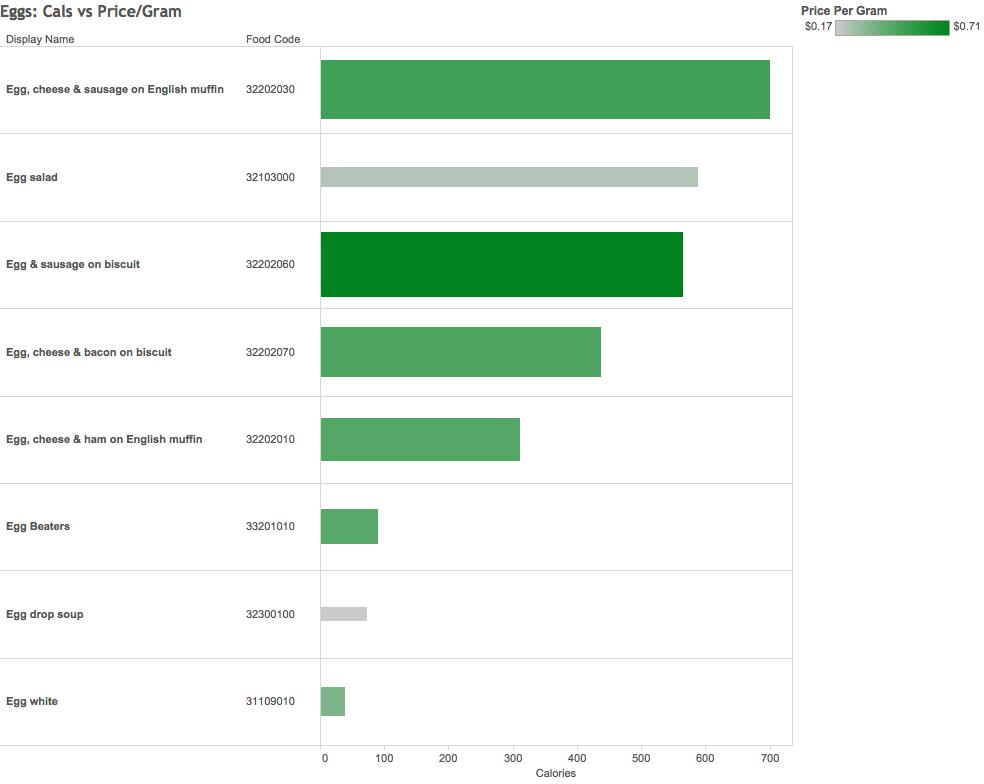
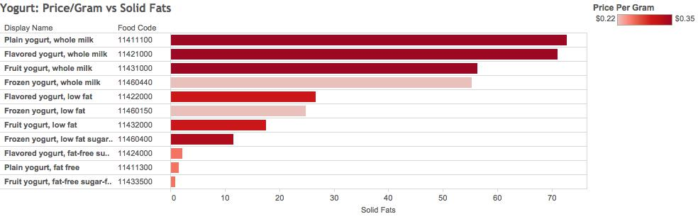
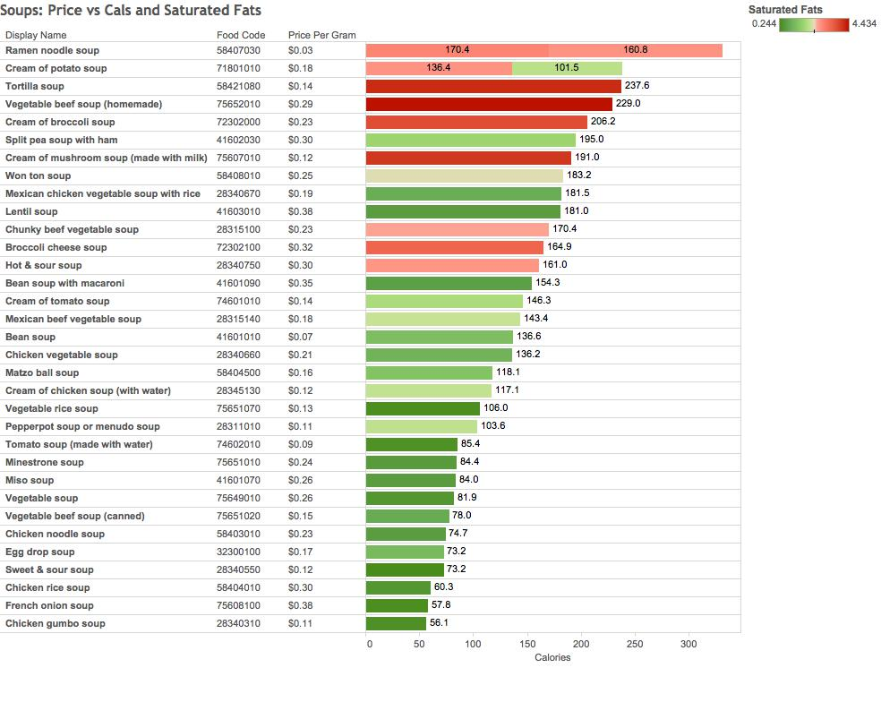
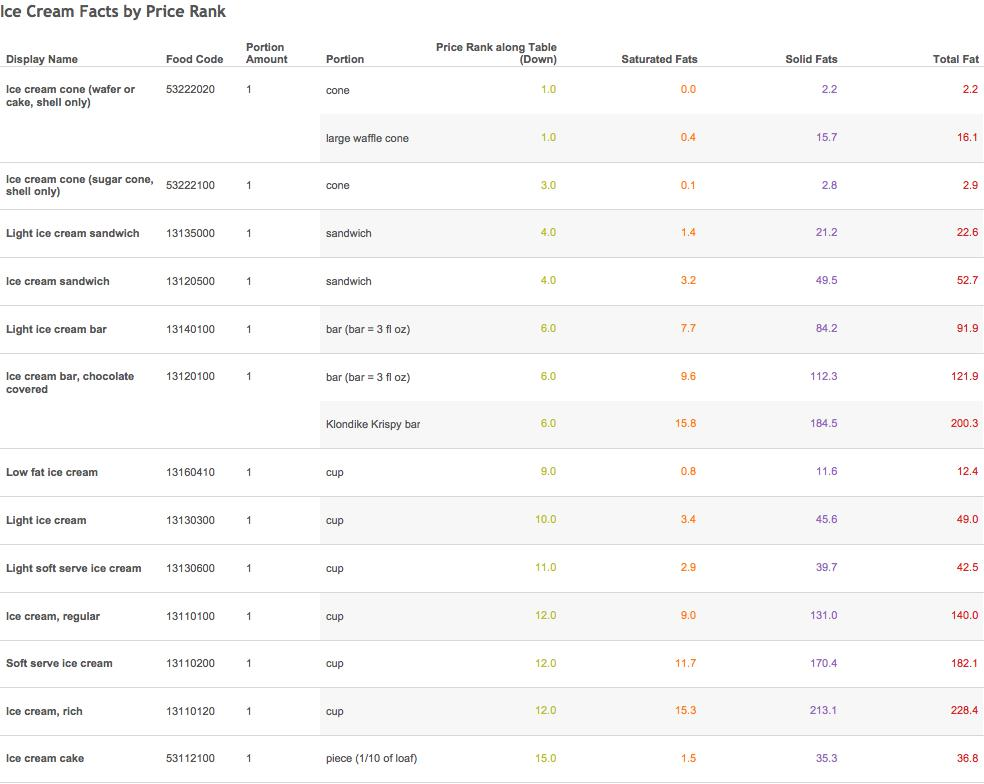

The Center for Nutirtion Polocy and Promotion (CNPP) Food Prices Database has the cost of consumed foods for 2003-2004. It was compiled to estimate USDA's Food Plans, and to show the cost of a nutritious diet at different cost levels.

In this project, I blend two datasets, provided for public use by the CNPP, and use Tableau to create various visualizations.

#The Data
```{r, include=FALSE, results = "hide"}
source("../00 Doc/packages.R", echo = FALSE)
```
```{r, message=FALSE}
source("../00 Doc/Project3dataframes.R", echo = FALSE)
```

The primary dataset includes food item names and unique food codes, and calories, saturated fats, and unsaturated fats per serving.
```{r, eval=FALSE}
foodcals_df <- data.frame(fromJSON(getURL(URLencode(gsub("\n", " ", '129.152.144.84:5001/rest/native/?query= "select FOOD_CODE, CALORIES, SATURATED_FATS, SOLID_FATS from FOOD_CALS_TABLE "')),httpheader=c(DB='jdbc:oracle:thin:@129.152.144.84:1521:ORCL', USER='C##cs329e_map4542', PASS='orcl_map4542', MODE='native_mode', MODEL='model', returnDimensions = 'False', returnFor = 'JSON'), verbose = TRUE)))
```

```{r, message=FALSE, echo = FALSE}
tbl_df(foodcals_df)
```

The secondary dataset includes the food item names and unique food codes, along with the dollar price per 100 grams of the item.
```{r, eval=FALSE}
foodprice_df <- data.frame(fromJSON(getURL(URLencode(gsub("\n", " ", '129.152.144.84:5001/rest/native/?query= "select FOOD_CODE, PRICE_PERGRAM from FOOD_PRICES_TABLE "')),httpheader=c(DB='jdbc:oracle:thin:@129.152.144.84:1521:ORCL', USER='C##cs329e_map4542', PASS='orcl_map4542', MODE='native_mode', MODEL='model', returnDimensions = 'False', returnFor = 'JSON'), verbose = TRUE)))
```

```{r, message=FALSE, echo = FALSE}
tbl_df(foodprice_df)
```

# Visualizations

Because there are over 2,000 items, I did each table blending with a filter on "food item names." 

For the first visualization, I created a filter for the key word "egg" and ordered the items in decreasing calorie count. I used the price per gram from the secondary dataset as a color key and a size indicator for the items most expensive per gram.


For the second visualization, I filtered by "yogurt" and created a color key from the secondary dataset's price per gram. I was interested in seeing the price per gram relative to the amount of solid fats per serving of each yogurt type.


In the third visualization, I was interested in comparing soups. Below, one can compare the amount of calories per item of soup relative to saturated fats.


In the final visualization, I ranked each "ice cream" item by price per gram. I compared the saturated fats and solid fats in each item, and created a new calculated field that summed the two to create a total fats column.



